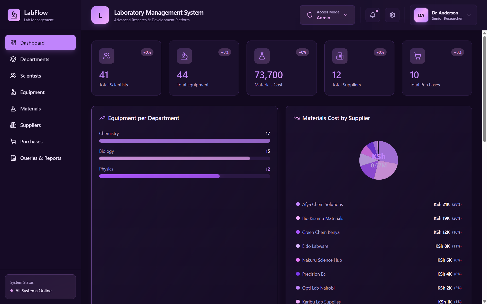

  <svg width="64" height="64" viewBox="0 0 64 64" style="filter: drop-shadow(0 0 12px rgba(192, 132, 252, 0.6));">
    <defs>
      
    </defs>
    <!-- Left Flask -->
    <g class="flask-left">
      <path d="M 12 20 L 14 12 Q 14 10 16 10 L 20 10 Q 22 10 22 12 L 24 20 L 24 35 Q 24 40 20 42 L 16 42 Q 12 40 12 35 Z" fill="none" stroke="#c084fc" stroke-width="1.5" stroke-linecap="round" stroke-linejoin="round"/>
      <circle class="bubble" cx="16" cy="45" r="1" fill="#f0abfc" opacity="0.7"/>
      <circle class="bubble" cx="20" cy="45" r="1" fill="#f0abfc" opacity="0.7"/>
    </g>
    <!-- Center Test Tube (rotating) -->
    <g class="tube">
      <rect x="30" y="8" width="4" height="32" rx="2" fill="none" stroke="#a855f7" stroke-width="1.5"/>
      <circle cx="32" cy="42" r="3" fill="none" stroke="#a855f7" stroke-width="1.5"/>
      <circle class="bubble" cx="32" cy="35" r="0.8" fill="#e879f9"/>
    </g>
    <!-- Right Flask (beaker) -->
    <g class="flask-right">
      <path d="M 42 20 L 42 12 Q 42 10 44 10 L 48 10 Q 50 10 50 12 L 50 35 Q 50 40 46 42 L 44 42 Q 40 40 40 35 Z" fill="none" stroke="#f0abfc" stroke-width="1.5" stroke-linecap="round" stroke-linejoin="round"/>
      <circle class="bubble" cx="44" cy="45" r="1" fill="#c084fc" opacity="0.7"/>
      <circle class="bubble" cx="48" cy="45" r="1" fill="#c084fc" opacity="0.7"/>
    </g>
  </svg>
  <h1 style="margin: 0; font-size: 2.5em; background: linear-gradient(135deg, #c084fc, #f0abfc); -webkit-background-clip: text; -webkit-text-fill-color: transparent; background-clip: text;">Laboratory Management System</h1>

A full-stack laboratory operations platform for managing scientists, equipment, materials, suppliers, purchases, activity logs, and report queries.

## What This Project Includes

- SQL Server schema and data scripts
- Express + Node.js backend API with role-based access control
- React + TypeScript frontend dashboard and management pages
- Activity logging with fallback feed for operational events
- Query/report execution with export-ready UI

## Tech Stack

- Frontend: React, TypeScript, Vite, Tailwind CSS, Motion, Recharts
- Backend: Node.js, Express, mssql (msnodesqlv8), dotenv
- Database: Microsoft SQL Server

## Repository Structure

- allthesqlscripts: database creation, seed, roles/auth, reports, dashboard queries
- Backend_Programs: API server, controllers, middleware, routes, DB connection
- Frontend_Programs: UI app, pages, components, API client, styles
- screenshots: documentation images

## Core Features

### Dashboard
- **Live KPI Cards**: Real-time metrics for scientists, equipment, suppliers, purchases, and material costs
- **Data Visualizations**: Equipment-by-department charts and material cost by supplier breakdowns
- **Activity Stream**: Recent activity feed with fallback rendering for operational events
- **Assignment Tracking**: Latest equipment assignments and material requests with status management
- **Status Updates**: Toggle activity status from pending to completed with persistent storage

### Scientists Management
- View all scientists with department and specialization metadata
- Add new scientists with department/specialization/gender mapping
- Update scientist information
- Delete scientists from the system
- Metadata-driven ID mapping for departments and specializations

### Equipment Management
- Complete equipment inventory with detailed specifications
- Add new equipment to the lab
- Update equipment details
- Delete equipment from inventory
- Equipment assignment tracking
- Add/update/delete equipment assignments to scientists
- View assignments with assignment status tracking

### Materials Management
- Full materials inventory system
- Add new materials with properties and quantities
- Update material information
- Delete materials
- Material request workflow
- Create/update/delete material requests
- Track material request status

### Suppliers Management
- Supplier directory and contact management
- Add new suppliers
- Update supplier information
- Delete suppliers
- Link suppliers to purchases

### Purchases Management
- Purchase order management system
- Create new purchase orders
- Update purchase details
- Delete purchases
- Dynamic status management (Pending → Completed)
- Persistent status storage across sessions
- Supplier email integration
- Material quantity tracking

### Queries & Reports
- Predefined query catalog
- Dynamic query execution
- Tabular result display
- Export to PDF and CSV formats
- Advanced filtering and sorting

### User Interface Features
- **Dark Theme with Purple Accents**: Modern, eye-friendly interface (#c084fc, #f0abfc, #a855f7)
- **Responsive Design**: Works seamlessly on desktop and tablet devices
- **Search & Filtering**: Quick search across all data tables
- **Pagination**: Efficient data browsing with customizable page sizes
- **Modal Dialogs**: Smooth, animated dialogs for add/edit operations
- **Status Indicators**: Visual status badges for pending, completed, and in-progress items
- **Activity Animations**: Smooth transitions and motion effects using Motion/React
- **Data Persistence**: Status changes persist across page reloads via localStorage

## Access Control

Backend authorization is based on request headers:

- x-user-role: viewer, editor, admin
- x-pin: required for editor write operations

Frontend role state is persisted and passed to backend via API client headers.

## Activity Logging Behavior

The activity API first reads activity_logs.
If logs are empty, it automatically builds a fallback feed from:

- equipment assignments
- material requests
- purchases

This ensures the dashboard activity panel is never blank on freshly seeded environments.

## Setup

## 1) Database

Run SQL scripts in order:

1. allthesqlscripts/01_create_database_and_tables_with_constraints.sql
2. allthesqlscripts/02_add_data_to_tables.sql
3. allthesqlscripts/03_table_alterations.sql
4. allthesqlscripts/04_roles_and_authentication.sql
5. allthesqlscripts/05_reports_n_queries_connector.sql
6. allthesqlscripts/06_dashboard_queries.sql

## 2) Backend

- Open Backend_Programs
- Install dependencies
- Configure .env
- Start server

Example .env values:

- PORT=3001
- DB_DATABASE=Laboratory_Management_System

Commands:

- npm install
- npm run start

## 3) Frontend

- Open Frontend_Programs
- Install dependencies
- Start Vite dev server

Commands:

- npm install
- npm run dev

Default frontend URL:

- http://localhost:5173

## API Base URL

Frontend API client default:

- http://localhost:3001/api

Override with:

- VITE_API_BASE_URL

## API Coverage (High-Level)

- /api/dashboard/*
- /api/activity
- /api/scientists
- /api/equipment
- /api/equipment/assignments
- /api/materials
- /api/materials/requests
- /api/suppliers
- /api/purchases
- /api/queries

## Notes for Screenshots

- Place dashboard screenshot at screenshots/dashboard-overview.png
- The title link at the top of this README points to that file

## Current Status

- Dashboard is live-data driven
- Activity feed supports fallback rendering
- CRUD actions are mapped to backend across core management pages
- Data persists across reloads when backend/database operations succeed

## Personal Note

This Laboratory Management System represents a complete, production-ready platform for managing laboratory operations. Built with modern tech stack (React, TypeScript, Node.js, SQL Server), the system demonstrates full-stack development practices including:

- **Robust Backend**: RESTful API with role-based access control, comprehensive error handling, and database transactions
- **Polished Frontend**: Dark-themed UI with smooth animations, responsive design, and intuitive workflows
- **Data Integrity**: Strict schema constraints, proper foreign key relationships, and activity logging
- **Real-world Features**: Status tracking with persistence, dynamic reporting, supplier integration, and export capabilities

Whether you're managing a research lab, a pharmaceutical facility, or an educational laboratory, this system provides the tools needed to streamline operations, track resources, and maintain audit trails. The modular architecture makes it easy to extend with additional features or adapt to specific organizational needs.

Perfect for learning full-stack development, or as a foundation for a production lab management solution.
